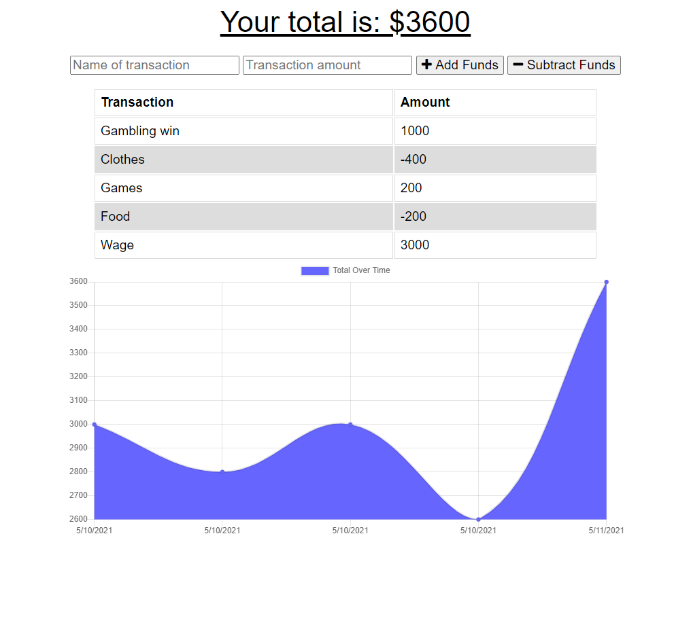

# Budget-Tracker-PWA

## 

## Table of Contents

- [Description](#Description)
- [Installation Instructions](#Installation-Instructions)
- [Usage Information](#Usage-Information)
- [Contribution Guidelines](#Contribution-Guidelines)
- [Test Instructions](#Test-Instructions)
- [GitHub Page](#GitHub-Page)
- [Questions](#Questions)

## Description

This is a budget tracker, an app for the user to log their budget and expenses. This is designed to be a PWA, and the user will be able to utilize most of the app's functionalities while being offline or experiencing slow connection speeds.

This app is deployed on Heroku and is available at the following link:

https://radiant-badlands-90762.herokuapp.com/

## Installation Instructions

```
Click the Install App button that shows up at the right end of the URL bar in the browser, or choose Add To Screen when in Safari on an iPhone.
```

## Usage Information

Upon reaching the page, the user will be able to see a graph for the previous fluctuations of their budget. A form exists on top of the graph for the user to input further entries that will dynamically update the graph. The user needs to give a name for the transaction, as well as an amount in dollars. After the form is submitted, the table of transactions as well as the graph will be promptly updated. User data is stored in MongoDB Atlas, and IndexedDB is the storage being used when the user is offline. When the user goes back online, previous transactions made when offline will be sent in bulk to sync with the database.

The app is designed as a PWA. It includes Manifest, Service Worker, and caching. The user can choose to install the app and use its functionalities instead of visiting the page.

## Sample Page

### Transactions and Graph



## Contribution Guidelines

```
N/A
```

## Test Instructions

```
N/A
```

## GitHub Page

https://github.com/runescape11111/Budget-Tracker-PWA

## Questions

GitHub profile: github.com/runescape11111/

Email: olivershih@gmail.com
